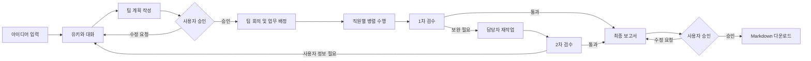

<div align="center">

# 🏢 YOUFFICE

### 아이디어부터 검수와 보고서까지, 함께 완성하는 로컬 AI 오피스

Python · Streamlit · Ollama · Qwen3 8B · SQLite

</div>


## 프로젝트 소개

**YOUFFICE**는 *Youmin + Office*의 합성어로, 사용자의 아이디어와 업무 요청을 여러 AI 직원이 역할별로 나누어 처리하는 로컬 멀티에이전트 오피스입니다.

단순히 한 번 답변하는 챗봇이 아니라 프로젝트 생성, 팀장과의 계획 수립, 사용자 승인, 직원별 업무 수행, 팀 회의, 검수와 재작업, 최종 보고서 작성까지 실제 조직에 가까운 흐름을 구현하는 것을 목표로 합니다. 기본 AI 응답은 로컬 Ollama에서 실행되며, 프로젝트 기록은 로컬 SQLite 데이터베이스에 저장됩니다.

## 주요 기능

- **아이디어 기반 프로젝트 시작**: 완성된 설계 없이 한 문장만으로 프로젝트를 만들고 AI 팀장과 구체화할 수 있습니다.
- **AI 직원 협업**: 팀장이 업무를 분석하고 기획, 설계, 검수, 보고 역할에 맞게 일을 배정합니다.
- **Human-in-the-loop**: 사용자가 팀장의 계획을 승인한 뒤에만 실제 팀 업무가 시작됩니다.
- **회의·검수·재작업 흐름**: 팀 회의 기록과 직원별 결과를 저장하고, 1차 검수에서 발견된 문제를 재작업한 뒤 2차 검수합니다.
- **최종 보고서 관리**: 구조화된 보고서를 생성하고 승인, 수정 요청, Markdown 다운로드를 지원합니다.
- **픽셀 오피스 시각화**: 직원별 대기·작업·검수·완료 상태와 실제 전달 내용을 오피스 화면에서 확인할 수 있습니다.
- **프로젝트별 기록 보존**: 대화, 자료, 출처, 장기 기억, 결정 사항, 오류, 업무 이력과 보고서를 SQLite에 저장합니다.
- **선택형 조사·교차 검토**: 무료 웹 검색을 기본 제공하며 Tavily 조사와 Gemini·Claude 교차 검토를 선택적으로 연결할 수 있습니다.

## 업무 진행 흐름



## AI 직원

| 직원 | 소속 / 역할 | 담당 업무 |
|---|---|---|
| 유키 | 총괄팀 · 프로젝트 팀장 | 요청 분석, 계획 수립, 업무 순서와 담당자 결정 |
| 희정 | 총괄팀 · 비서 | 프로젝트 기억과 필요한 정보 정리 |
| 리오 | 기획팀 · 기획팀장 | 일정, 예산, 자료 조사와 근거 기반 기획 |
| 미츠리 | 기획팀 · 기획 설계 담당 | 시스템 구성과 구현 방안 설계 |
| 레비 | 검수팀 · 검수 담당 | 오류, 위험, 누락, 근거와 실현 가능성 검토 |
| 마코 | 보고서팀 · 보고서 부장 | 결과 종합, 가독성 검토와 최종 보고서 작성 |

## 기술 스택

| 구분 | 기술 |
|---|---|
| 언어 | Python 3.12 |
| 웹 UI | Streamlit 1.60 |
| 로컬 LLM | Ollama + Qwen3 8B |
| 데이터베이스 | SQLite |
| 기본 웹 검색 | DDGS |
| 선택형 연동 | Tavily, Gemini, Claude |

## 빠른 시작

### 1. 준비 사항

- Windows 10/11
- Python 3.12
- [Ollama](https://ollama.com/) 설치
- Git

### 2. 저장소와 Python 환경 준비

```powershell
git clone https://github.com/youmin00/Youffice_refactor_test.git
cd Youffice_refactor_test
py -3.12 -m venv .venv
.\.venv\Scripts\Activate.ps1
python -m pip install --upgrade pip
pip install -r requirements.txt
```

PowerShell에서 가상환경 활성화가 차단되면 현재 창에만 아래 정책을 적용한 뒤 다시 실행합니다.

```powershell
Set-ExecutionPolicy -Scope Process -ExecutionPolicy Bypass
.\.venv\Scripts\Activate.ps1
```

### 3. 로컬 모델 준비

```powershell
ollama pull qwen3:8b
```

### 4. YOUFFICE 실행

가장 간단한 방법은 프로젝트 루트의 `YOUFFICE_실행.vbs`를 더블클릭하는 것입니다. 실행 스크립트가 사전 점검을 수행하고 Streamlit 서버를 시작한 뒤 브라우저를 엽니다.

PowerShell에서 직접 실행하려면 다음 명령을 사용합니다.

```powershell
powershell -ExecutionPolicy Bypass -File .\tools\start_youffice.ps1
```

실행 후 브라우저에서 <http://127.0.0.1:8501>에 접속합니다.

## 선택형 외부 연동

기본 대화와 팀 업무는 Ollama만으로 실행할 수 있습니다. 아래 기능을 사용할 때만 별도의 키가 필요합니다.

| 기능 | 필요한 환경 변수 |
|---|---|
| Tavily 웹 조사 | `TAVILY_API_KEY` |
| Gemini 교차 검토 | `GEMINI_API_KEY`, `YOUFFICE_GEMINI_MODEL` |
| Claude 교차 검토 | `ANTHROPIC_API_KEY`, `YOUFFICE_CLAUDE_MODEL` |

예시:

```powershell
setx TAVILY_API_KEY "발급받은_API_키"
setx GEMINI_API_KEY "발급받은_API_키"
setx YOUFFICE_GEMINI_MODEL "사용할_모델_ID"
setx ANTHROPIC_API_KEY "발급받은_API_키"
setx YOUFFICE_CLAUDE_MODEL "사용할_모델_ID"
```

`setx`로 값을 저장한 뒤에는 열려 있던 터미널과 YOUFFICE 서버를 종료하고 다시 실행해야 합니다. 실제 API 키는 코드, 문서, 커밋에 포함하지 마세요. 자세한 내용은 [외부 AI 설정 안내](EXTERNAL_AI_SETUP.md)를 참고하세요.

## 프로젝트 구조

```text
Youffice_refactor_test/
├─ app.py                   # Streamlit 앱 진입점과 화면 연결
├─ database.py              # SQLite 스키마와 핵심 데이터 API
├─ conversation/            # 직원 프롬프트, 대화 상태, 응답 검증
├─ workflow/                # 배정, 회의, 실행, 검수, 보고 흐름
├─ ui/                      # 오피스, 대화, 프로젝트와 기록 UI
├─ animation/               # 직원 상태 애니메이션
├─ assets/ · static/        # 오피스, 직원, 방 이미지 리소스
├─ data/                    # 로컬 프로젝트 데이터
├─ tools/                   # 실행, 사전 점검과 회귀 테스트 도구
└─ requirements.txt         # Python 의존성
```

## 점검

전체 Python 문법, 주요 모듈 import, 핵심 API와 데이터베이스 경로를 한 번에 확인합니다.

```powershell
.\.venv\Scripts\python.exe .\tools\preflight_check.py
```

개별 회귀 테스트는 프로젝트 루트에서 다음과 같이 실행할 수 있습니다.

```powershell
.\.venv\Scripts\python.exe -m unittest discover -s tools -p "test_*.py"
```

## 데이터와 개인정보

- 프로젝트 데이터는 기본적으로 `data/youffice.db`에 로컬 저장됩니다.
- `.env`, Streamlit secrets, 데이터베이스, 실행 로그와 런타임 상태 파일은 `.gitignore`에서 제외됩니다.
- 외부 조사 또는 교차 검토 기능을 사용하면 선택한 외부 서비스로 해당 요청 정보가 전송될 수 있습니다.

## 현재 상태

YOUFFICE는 개인 포트폴리오 목적으로 개발 중인 프로젝트입니다. 로컬 모델의 응답 품질은 사용 중인 모델, 하드웨어 성능, 입력 내용에 따라 달라질 수 있으며 생성 결과는 중요한 의사결정 전에 반드시 사용자가 검토해야 합니다.

