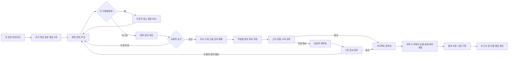

<div align="center">

# 🏢 YOUFFICE

### 막연한 아이디어를 실제로 시작할 수 있는 준비서로 바꾸는 로컬 AI 오피스

Python · Streamlit · Ollama · Qwen3 8B · SQLite

</div>

> **개발 상태: 진행 중**
>
> YOUFFICE는 개인 포트폴리오를 위해 개발 중인 프로젝트입니다. 현재 핵심 대화·협업·기록 관리 흐름은 구현되어 있으며, 기능 완성도와 사용자 경험을 계속 개선하고 있습니다.


## 프로젝트 소개

**YOUFFICE**는 *Youmin + Office*의 합성어로, 혼자 프로젝트를 시작하는 학생의 막연한 아이디어를 요구사항, 선택 근거, 조사 자료, 제작 전 계획과 테스트 기준으로 바꾸는 로컬 멀티에이전트 오피스입니다.

YOUFFICE는 CAD 도면, 실제 구매·조립, 코드 실행이나 성능 시험을 대신 완료하는 도구가 아닙니다. AI 직원들은 프로젝트별로 요구사항과 결정을 기억하고, 조사·기획·기술 검토·위험 점검·문서화를 나누어 수행합니다. 사용자는 준비서를 바탕으로 전문 도구에서 실제 설계·개발·제작을 진행하고, 그 결과와 문제를 다시 YOUFFICE에 기록해 다음 행동과 보고서로 연결할 수 있습니다. 기본 AI 응답은 로컬 Ollama에서 실행되며, 프로젝트 기록은 로컬 SQLite 데이터베이스에 저장됩니다.

## 주요 기능

- **사용자 주도 구체화 대화**: 유키는 먼저 핵심 질문 3개 안에서 초안을 만들고, 이후에는 사용자가 원하는 만큼 중요한 항목을 하나씩 구체화합니다. 사용자가 유키에게 묻는 질문은 이 횟수에 포함되지 않습니다.
- **제작 준비 계획**: 한 문장 아이디어를 요구사항, 선택지, 조사 항목, 기술 조건, 위험과 테스트 계획으로 구체화합니다.
- **AI 직원 협업**: 팀장이 준비 업무를 나누고 기획, 기술 요구사항, 위험 검토와 문서화 담당이 서로의 결과를 검토합니다.
- **사용자 주도 승인**: 사용자가 제작 준비 계획을 승인한 뒤에만 직원별 자료 작성이 시작됩니다.
- **준비서·진행 기록 관리**: 구조화된 프로젝트 준비서와 실제 제작·개발 중 발생한 결정, 오류, 시험 기록을 분리해 저장합니다.
- **픽셀 오피스 시각화**: 직원별 대기·작업·검수·완료 상태와 실제 전달 내용을 오피스 화면에서 확인할 수 있습니다.
- **프로젝트별 기록 보존**: 대화, 자료, 출처, 장기 기억, 결정 사항, 오류, 업무 이력과 보고서를 SQLite에 저장합니다.
- **선택형 조사·교차 검토**: 무료 웹 검색을 기본 제공하며 Tavily 조사와 Gemini·Claude 교차 검토를 선택적으로 연결할 수 있습니다.

## 업무 진행 흐름



## AI 직원

| 직원 | 소속 / 역할 | 담당 업무 |
|---|---|---|
| 유키 | 총괄팀 · 프로젝트 팀장 | 핵심 질문 제한, 요구사항 정리, 준비 계획과 다음 행동 결정 |
| 희정 | 총괄팀 · 비서 | 프로젝트 기억, 확정 사항과 변경 이력 관리 |
| 리오 | 기획팀 · 기획팀장 | 선택 기준, 예산, 일정, 자료 조사와 근거 기반 기획 |
| 미츠리 | 기획팀 · 기술 설계 담당 | 기술 요구사항, 구성 후보와 외부 도구 전달 체크리스트 |
| 레비 | 검수팀 · 검수 담당 | 위험, 누락, 근거, 실현 가능성과 실제 확인 항목 검토 |
| 마코 | 보고서팀 · 보고서 부장 | 준비 자료 종합, 사용자 행동 순서와 프로젝트 문서 작성 |

## 기술 스택

| 구분 | 기술 |
|---|---|
| 언어 | Python 3.12 |
| 웹 UI | Streamlit 1.60 |
| 로컬 LLM | Ollama + Qwen3 8B |
| 데이터베이스 | SQLite |
| 기본 웹 검색 | DDGS |
| 선택형 연동 | Tavily, Gemini, Claude |

## 빠른 시작

### 1. 준비 사항

- Windows 10/11
- Python 3.12
- [Ollama](https://ollama.com/) 설치
- Git

### 2. 저장소와 Python 환경 준비

```powershell
git clone https://github.com/youmin00/Youffice.git
cd Youffice
py -3.12 -m venv .venv
.\.venv\Scripts\Activate.ps1
python -m pip install --upgrade pip
pip install -r requirements.txt
```

PowerShell에서 가상환경 활성화가 차단되면 현재 창에만 아래 정책을 적용한 뒤 다시 실행합니다.

```powershell
Set-ExecutionPolicy -Scope Process -ExecutionPolicy Bypass
.\.venv\Scripts\Activate.ps1
```

### 3. 로컬 모델 준비

```powershell
ollama pull qwen3:8b
```

### 4. YOUFFICE 실행

가장 간단한 방법은 프로젝트 루트의 `YOUFFICE_실행.vbs`를 더블클릭하는 것입니다. 실행 스크립트가 사전 점검을 수행하고 Streamlit 서버를 시작한 뒤 브라우저를 엽니다.

PowerShell에서 직접 실행하려면 다음 명령을 사용합니다.

```powershell
powershell -ExecutionPolicy Bypass -File .\tools\start_youffice.ps1
```

실행 후 브라우저에서 <http://127.0.0.1:8501>에 접속합니다.

## 선택형 외부 연동

기본 대화와 팀 업무는 Ollama만으로 실행할 수 있습니다. 아래 기능을 사용할 때만 별도의 키가 필요합니다.

| 기능 | 필요한 환경 변수 |
|---|---|
| Tavily 웹 조사 | `TAVILY_API_KEY` |
| Gemini 교차 검토 | `GEMINI_API_KEY`, `YOUFFICE_GEMINI_MODEL` |
| Claude 교차 검토 | `ANTHROPIC_API_KEY`, `YOUFFICE_CLAUDE_MODEL` |

예시:

```powershell
setx TAVILY_API_KEY "발급받은_API_키"
setx GEMINI_API_KEY "발급받은_API_키"
setx YOUFFICE_GEMINI_MODEL "사용할_모델_ID"
setx ANTHROPIC_API_KEY "발급받은_API_키"
setx YOUFFICE_CLAUDE_MODEL "사용할_모델_ID"
```

`setx`로 값을 저장한 뒤에는 열려 있던 터미널과 YOUFFICE 서버를 종료하고 다시 실행해야 합니다. 실제 API 키는 코드, 문서, 커밋에 포함하지 마세요. 자세한 내용은 [외부 AI 설정 안내](EXTERNAL_AI_SETUP.md)를 참고하세요.

## 프로젝트 구조

```text
Youffice/
├─ app.py                   # Streamlit 앱 진입점과 화면 연결
├─ database.py              # SQLite 스키마와 핵심 데이터 API
├─ conversation/            # 직원 프롬프트, 대화 상태, 응답 검증
├─ workflow/                # 배정, 회의, 실행, 검수, 보고 흐름
├─ ui/                      # 오피스, 대화, 프로젝트와 기록 UI
├─ animation/               # 직원 상태 애니메이션
├─ assets/ · static/        # 오피스, 직원, 방 이미지 리소스
├─ data/                    # 로컬 프로젝트 데이터
├─ tools/                   # 실행, 사전 점검과 회귀 테스트 도구
└─ requirements.txt         # Python 의존성
```

## 점검

전체 Python 문법, 주요 모듈 import, 핵심 API와 데이터베이스 경로를 한 번에 확인합니다.

```powershell
.\.venv\Scripts\python.exe .\tools\preflight_check.py
```

개별 회귀 테스트는 프로젝트 루트에서 다음과 같이 실행할 수 있습니다.

```powershell
.\.venv\Scripts\python.exe -m unittest discover -s tools -p "test_*.py"
```

## 데이터와 개인정보

- 프로젝트 데이터는 기본적으로 `data/youffice.db`에 로컬 저장됩니다.
- `.env`, Streamlit secrets, 데이터베이스, 실행 로그와 런타임 상태 파일은 `.gitignore`에서 제외됩니다.
- 외부 조사 또는 교차 검토 기능을 사용하면 선택한 외부 서비스로 해당 요청 정보가 전송될 수 있습니다.
- 저장소에 포함된 기본 직원 조직은 가상의 역할·이름과 AI 생성 캐릭터 아바타로만 구성됩니다. 실제 사용자 프로필이나 대화 데이터는 포함하지 않습니다.
- 개인 개발 인수인계 문서와 참조 영상은 공개 저장소에서 제외합니다.

## 현재 상태

YOUFFICE는 개인 포트폴리오 목적으로 개발 중인 프로젝트입니다. 목표 결과는 완성품이 아니라 사용자가 실제 작업을 시작하고 이어갈 수 있는 프로젝트 준비서와 기록입니다. 로컬 모델의 응답 품질은 모델, 하드웨어와 입력 내용에 따라 달라질 수 있으며 부품 호환성, 도면, 코드 실행, 안전성과 시험 결과는 반드시 사용자가 실제 환경에서 확인해야 합니다.

## License

MIT License. See [LICENSE](LICENSE).
